# Claude Code PRO — курс и гайд

> Практический курс по работе с **Claude Code** на русском: от первого запуска до профессиональной настройки команды.
> CLAUDE.md, settings, skills, subagents, hooks, MCP, плагины, headless-режим и CI — с лабораторными работами и готовыми шаблонами, которые можно скопировать в свой проект. 🧠 **[Machine learning](https://t.me/+PwIsGaFpgjhkNTdi)** — здесь можно найти полный список самых крутых ИИ курсво, чтобы стать гуру ИИ и множество полезных инструментов и уроками работы с ними, абсолютных мастхев!

[](https://github.com/justxor/claude-code-pro-course/actions/workflows/validate.yml)


---

## Содержание

| Старт | Как это работает | Практика | Справочник |
|---|---|---|---|
| [Быстрый старт](#быстрый-старт-за-5-минут) | [Агентный цикл](#как-работает-claude-code) | [Продвинутые приёмы](#продвинутые-приёмы-работы-с-claude-code) | [Безопасность](#безопасность-и-разрешения) |
| [Маршрут обучения](#маршрут-обучения) | [Конфигурация](#как-устроена-конфигурация-claude-code) | [Рецепты задач](#практические-рецепты-задач) | [Шаблоны](#готовые-шаблоны) |
| [Программа](#программа) | [Принципы](#главные-принципы-tldr) | [Антипаттерны](#антипаттерны-и-как-их-исправить) | [Экономия](#экономия-контекста-и-денег) · [Проблемы](#частые-проблемы) |

## Что внутри

| | |
|---|---|
| 📚 **[12 модулей](#программа)** | Теория с примерами: от установки до мульти-агентной работы |
| 🧪 **[8 лабораторных](labs/)** | Задания с критериями «готово» — закрепить на практике |
| 🧰 **[Starter kit](starter-kit/)** | 8 skills, 5 субагентов, 4 hooks, правила, statusline, output style — ставится одной командой |
| 💬 **[Библиотека промптов](recipes/prompts.md)** | Проверенные формулировки для 13 типов задач |
| 🧩 **[Пример плагина](plugin-example/)** | Как упаковать настройки и раздать команде |
| ⚙️ **[GitHub Actions](.github/workflows/)** | `@claude` в issues/PR и авто-ревью |
| 📋 **[Шпаргалка](course/cheatsheet.md) · [FAQ](course/faq.md)** | Всё важное на одной странице и решения типичных проблем |

## Полезные ресурсы
- 🧠 **[Machine learning](https://t.me/+PwIsGaFpgjhkNTdi)** — ИИ-инструменты для генерации Python кода, умные-агенты и все что нужно знать из области AI.
- 🖥 **[Pythonl](https://t.me/+pwTlhtK8vEY4Mjky)**— с помощью понятных картинок и коротких видео авторы объясняют сложные концепции и учат профессиональному подходу в разработке.
- 🖥 **[Python Интервью](https://t.me/+sTT6sbZubDM2MWEy)** — огромное количество разобранных вопросов с реальных собеседований Python разработчика.
- 📖 **[PythonBooks](https://t.me/+VnfYvBmK_ZM3YzIy)** ([2](https://t.me/+8Dvl5VlUs5NhMTIy)) — мы создали канал с книгами по Linux и залили туда наверное самую большую подборку книг.
- 💼 **[Python Jobs](https://t.me/+eQsE0ZVnmINmNjQy)** — вакансии и подработка для Python разработчиков.
- 🔝 **[А здесь мы собрали](https://t.me/addlist/8vDUwYRGujRmZjFi)** целый кладезь полезных Python ресурсов для прокачки.
- 🔥 **[Больше крутых курсов и полезных ИИ-инструментов](https://t.me/ai_machinelearning_big_data/10997)** — регулярно публикую здесь.
- 📦 **[Harness_ru](https://github.com/justxor/Harness_ru)** — полный курс по Harness 2026 на русском языке: всё, что нужно знать, в одном месте.

## Для кого

- Разработчики, которые уже пробовали Claude Code и хотят выжать из него максимум.
- Тимлиды, которым нужно настроить единые правила для команды.
- Все, кто хочет автоматизировать рутину: ревью, тесты, коммиты, CI.

## Быстрый старт за 5 минут

```bash
# 1. Установите Claude Code
curl -fsSL https://claude.ai/install.sh | bash     # macOS / Linux / WSL
# или: npm install -g @anthropic-ai/claude-code

# 2. Поставьте starter-kit в свой проект
git clone https://github.com/justxor/claude-code-pro-course.git
bash claude-code-pro-course/install.sh ~/path/to/my-project

# 3. Запустите
cd ~/path/to/my-project && claude
> /context          # что загружено
> /onboard          # skill из starter-kit: обзор проекта
```

## Маршрут обучения

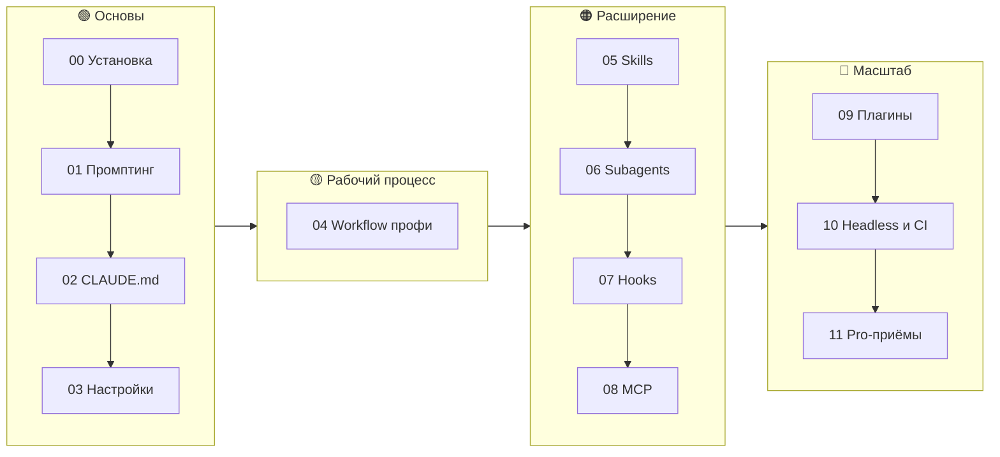

## Программа

| # | Модуль | Что освоите | Практика |
|---|--------|-------------|----------|
| 00 | [Установка и первый запуск](course/00-install.md) | Установка, логин, интерфейс, горячие клавиши | — |
| 01 | [Основы работы и промптинг](course/01-basics-prompting.md) | Постановка задач, контекст, @-упоминания, изображения | — |
| 02 | [CLAUDE.md — память проекта](course/02-claude-md.md) | Иерархия, импорты, `.claude/rules/` | [Лаба 1](labs/lab-01-onboarding.md) |
| 03 | [Настройки и разрешения](course/03-settings-permissions.md) | settings.json, allow/ask/deny, режимы, модели | [Лаба 2](labs/lab-02-permissions.md) |
| 04 | [Workflow профи](course/04-workflow.md) | Plan mode, TDD, чекпоинты, управление контекстом | [Лаба 3](labs/lab-03-tdd-feature.md) |
| 05 | [Skills и slash-команды](course/05-skills.md) | SKILL.md, аргументы, авто-вызов | [Лаба 4](labs/lab-04-skill.md) |
| 06 | [Subagents](course/06-subagents.md) | Изоляция контекста, специализация, параллельность | [Лаба 5](labs/lab-05-subagents.md) |
| 07 | [Hooks](course/07-hooks.md) | Автоформат, защита файлов, уведомления | [Лаба 6](labs/lab-06-hooks.md) |
| 08 | [MCP](course/08-mcp.md) | GitHub, браузер, БД, свои серверы | [Лаба 7](labs/lab-07-mcp.md) |
| 09 | [Плагины и маркетплейсы](course/09-plugins.md) | Упаковка и раздача конфигурации команде | [Пример](plugin-example/) |
| 10 | [Headless, CI и GitHub Actions](course/10-headless-ci.md) | `claude -p`, JSON, `@claude` в PR, Agent SDK | [Лаба 8](labs/lab-08-automation.md) |
| 11 | [Продвинутые приёмы](course/11-pro-tips.md) | Worktrees, мульти-агенты, экономия, безопасность | Чек-листы |

## Как работает Claude Code

Claude Code — это **агент**, а не автодополнение: он сам решает, какие файлы прочитать и какие команды запустить, и крутит цикл «действие → проверка», пока задача не решена. Ваша работа — дать ему цель, контекст и способ проверить результат.

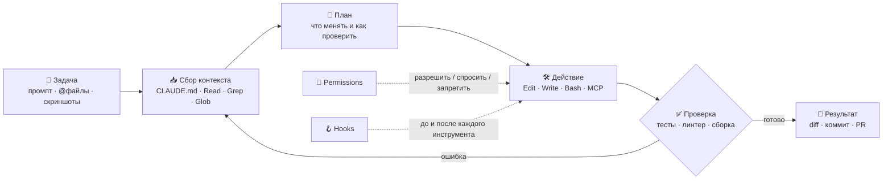

### Контекст — главный ресурс

Всё, что Claude «знает» в сессии, лежит в одном окне контекста. Чем оно чище, тем точнее ответы. Посмотреть, чем оно занято, — `/context`.

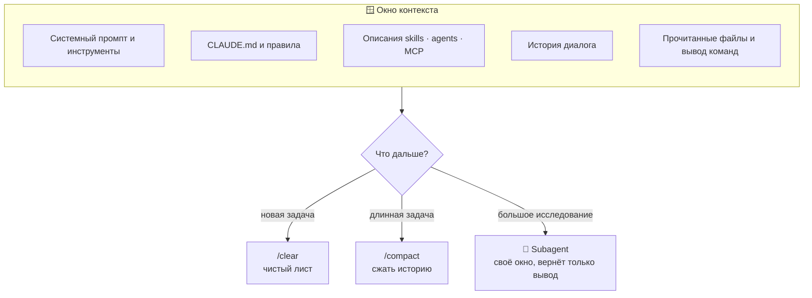

## Как устроена конфигурация Claude Code

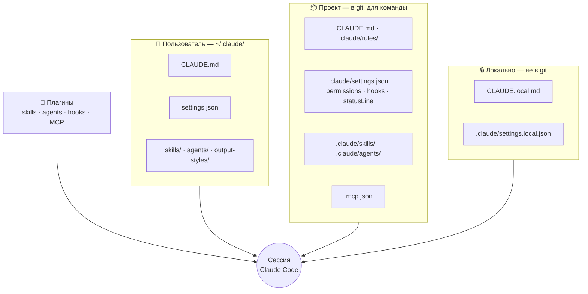

**Что куда класть:**

| Хочу… | Инструмент |
|---|---|
| чтобы Claude знал правила проекта | `CLAUDE.md`, `.claude/rules/` |
| не отвечать на одни и те же вопросы о разрешениях | `permissions.allow` в settings |
| запретить опасное | `permissions.deny` + hook `PreToolUse` |
| переиспользовать процедуру / промпт | **skill** |
| изолировать исследование или дать узкую роль | **subagent** |
| чтобы что-то происходило **всегда** | **hook** |
| подключить внешнюю систему | **MCP** |
| раздать всё это другим репозиториям | **плагин** |
| запускать без человека | `claude -p`, GitHub Actions, Agent SDK |

### Как выбрать инструмент

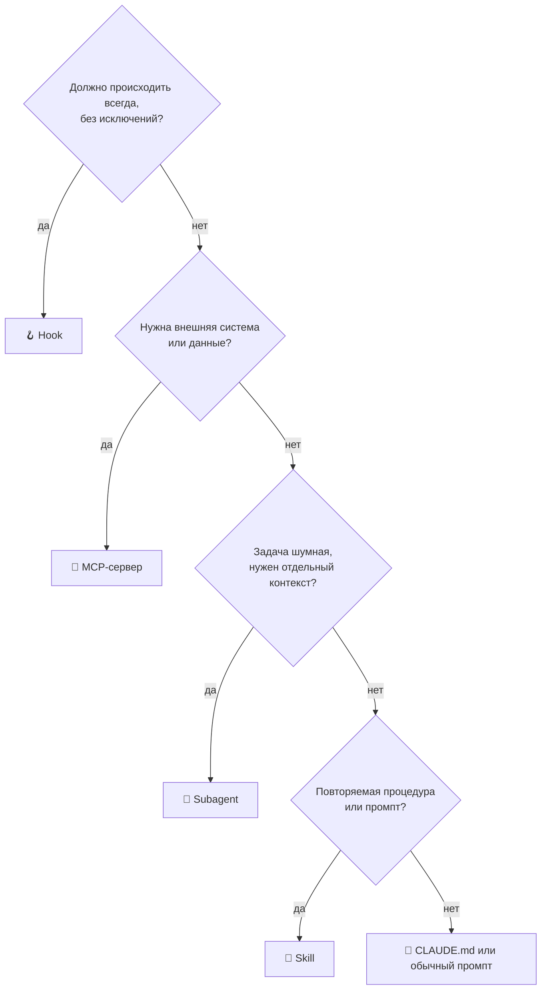

## Главные принципы (TL;DR)

1. **Контекст — ваш главный ресурс.** Чистите (`/clear`), сжимайте (`/compact`), выносите исследование в subagents.
2. **Сначала план, потом код.** Plan mode (`Shift+Tab`) для всего, что сложнее одного файла.
3. **Дайте Claude способ проверить себя** — тесты, линтер, скриншоты. Это самый сильный рычаг качества.
4. **CLAUDE.md короткий и конкретный.** Команды, стиль, запреты. Не роман.
5. **Повторяется трижды — сделайте skill.** Должно случаться всегда — сделайте hook.
6. **Разрешения — через allowlist,** а не через `bypassPermissions`.

## Продвинутые приёмы работы с Claude Code

### Режимы работы

`Shift+Tab` переключает режимы по кругу:

| Режим | Что делает Claude | Когда использовать |
|---|---|---|
| **Обычный** | Спрашивает разрешение на правки и команды | Незнакомый код, рискованные изменения |
| **Auto-accept edits** | Правит файлы без подтверждения | План согласован, есть тесты и git |
| **Plan mode** | Только читает и предлагает план | Старт любой нетривиальной задачи |

### Explore → Plan → Code → Verify → Commit

Главный рабочий цикл. Не давайте Claude сразу писать код: сначала пусть разберётся и предложит план.

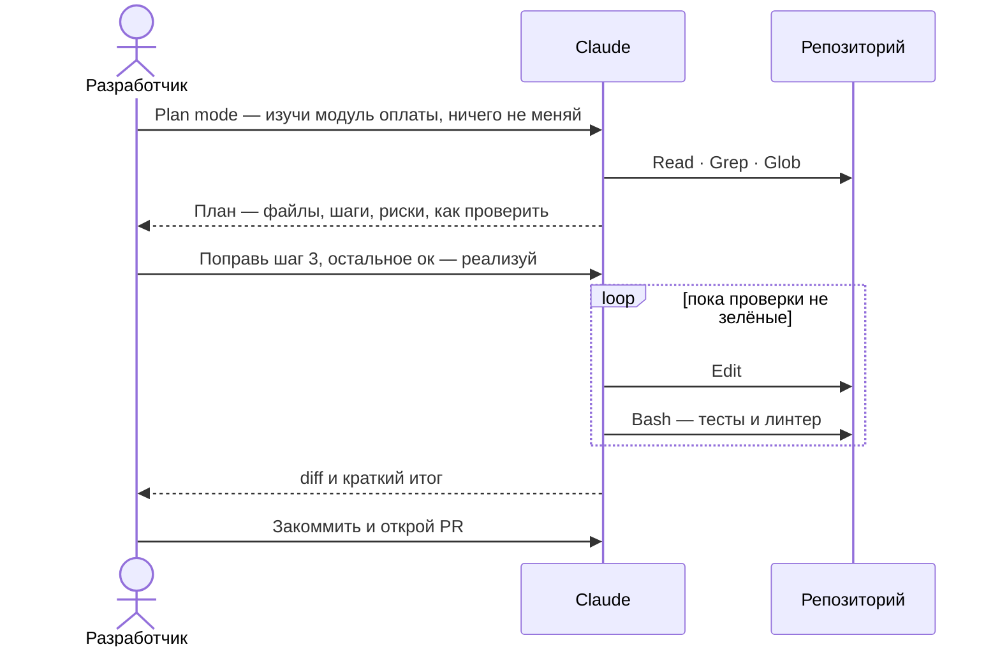

### Промпты, которые работают

| ❌ Размыто | ✅ Конкретно |
|---|---|
| «Почини баг» | «При пустом email `signup()` падает с TypeError. Воспроизведи тестом, исправь, прогони `npm test`.» |
| «Добавь тесты» | «Покрой `parseDate` тестами: границы месяцев, таймзоны, невалидный ввод. Без моков, стиль как в `utils.test.ts`.» |
| «Отрефактори» | «Вынеси работу с БД из `orders.ts` в репозиторий. Публичный API не меняй, существующие тесты должны пройти без правок.» |
| «Сделай красиво» | «Сверстай по скриншоту, сними скриншот результата через браузерный MCP, сравни и исправь расхождения.» |

Формула: **цель + где искать + ограничения + как проверить**.

### Контекст и память

- **CLAUDE.md — память проекта.** `/init` создаёт его автоматически. Стек, команды сборки и тестов, стиль, запреты — коротко. Редактировать — `/memory`.
- **Одна задача — одна сессия.** `/clear` перед новой задачей, `/compact` для длинной (можно с подсказкой: `/compact оставь только решения по API`).
- **`@` для файлов** — `@src/api/client.ts` сразу кладёт файл в контекст, без поиска.
- **`!` для команд** — `!git status` выполнит команду и покажет вывод Claude.
- **Скриншоты и логи** вставляйте прямо в чат или передавайте через пайп: `cat error.log | claude`.
- **Пусть Claude ведёт заметки.** Для долгих задач попросите вести `PLAN.md` или `NOTES.md` — после `/clear` работу легко продолжить.

### Дайте Claude способ проверить себя

Без обратной связи агент угадывает, с ней — итерирует до результата:

- тесты и тайпчекер (`npm test`, `pytest`, `tsc --noEmit`);
- линтер и форматтер (лучше через hook — тогда всегда);
- скриншоты UI через браузерный MCP (Playwright, Chrome);
- эталонный вывод: «скрипт должен напечатать ровно это».

### Hooks: гарантии вместо просьб

CLAUDE.md — это просьба, hook — это правило. Hook запускается на событии и может заблокировать действие.

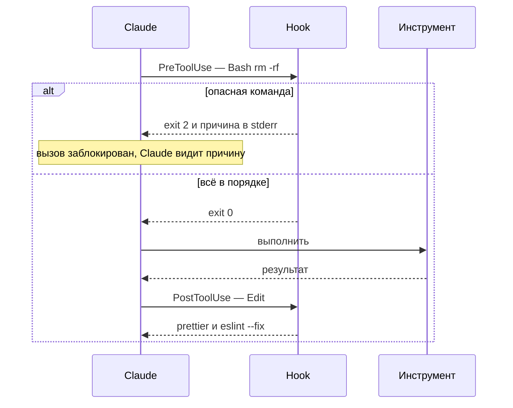

Автоформат после каждой правки (`.claude/settings.json`):

```json
{
  "hooks": {
    "PostToolUse": [
      {
        "matcher": "Edit|Write",
        "hooks": [
          { "type": "command", "command": "jq -r '.tool_input.file_path' | xargs npx prettier --write" }
        ]
      }
    ]
  }
}
```

| Событие | Пример использования |
|---|---|
| `SessionStart` | подгрузить текущую ветку, открытые задачи |
| `UserPromptSubmit` | добавить контекст к каждому промпту |
| `PreToolUse` | запретить `rm -rf`, правки `.env` и миграций |
| `PostToolUse` | форматтер, линтер, тесты по изменённому файлу |
| `Notification` | уведомление на рабочий стол, когда Claude ждёт вас |
| `Stop` | финальная проверка: тесты зелёные — можно завершать |
| `PreCompact` | сохранить важное перед сжатием контекста |

### Subagents: специалисты со своим контекстом

Субагент работает в отдельном окне контекста и возвращает только вывод — главная сессия остаётся чистой.

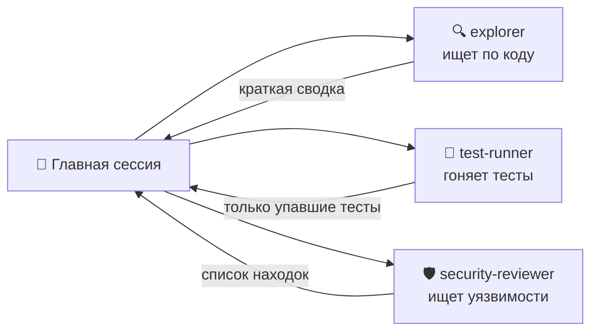

`.claude/agents/reviewer.md`:

```markdown
---
name: reviewer
description: Ревью изменений перед коммитом. Используй после любой заметной правки.
tools: Read, Grep, Glob, Bash
model: sonnet
---
Ты строгий ревьюер. Проверь git diff на баги, пограничные случаи,
утечки секретов и нарушения стиля из CLAUDE.md.
Отвечай списком: файл:строка — проблема — как исправить.
```

### Параллельная работа через git worktree

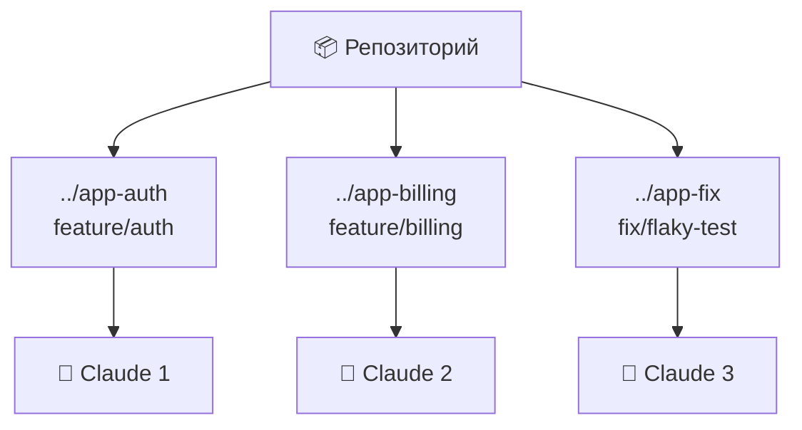

```bash
git worktree add ../app-auth -b feature/auth
cd ../app-auth && claude
```

Каждая сессия работает в своей папке и ветке — задачи идут параллельно и не мешают друг другу.

**Writer / Reviewer:** один Claude пишет код, второй в чистой сессии делает ревью, первый исправляет по замечаниям. Свежий контекст замечает то, что «замылилось».

### Headless и автоматизация

```bash
# Разовый запрос в скрипте или CI
claude -p "Найди причину падения сборки" --output-format json < build.log

# Ревью своего diff перед пушем
git diff main | claude -p "Сделай ревью: баги, пограничные случаи, безопасность"

# Ограничить инструменты и число шагов
claude -p "Обнови CHANGELOG по последним коммитам" --allowedTools "Read,Edit,Bash(git log:*)" --max-turns 10

# Массовая миграция: файл за файлом
for f in $(git ls-files 'src/**/*.js'); do
  claude -p "Переведи $f на TypeScript, не меняя поведения" --allowedTools "Read,Edit,Bash(npx tsc:*)"
done
```

### Шпаргалка по управлению

| Клавиша / команда | Что делает |
|---|---|
| `Esc` | прервать Claude, не теряя контекст |
| `Esc Esc` · `/rewind` | откатиться к прошлому шагу (код и диалог) |
| `Shift+Tab` | переключить режим: обычный → auto-accept → plan |
| `@файл` · `!команда` | добавить файл / вывод команды в контекст |
| `/clear` · `/compact` · `/context` | очистить, сжать, посмотреть контекст |
| `/model` | сменить модель |
| `/permissions` · `/hooks` · `/agents` · `/mcp` | настройка разрешений, хуков, агентов, MCP |
| `claude --continue` · `claude --resume` | продолжить последнюю / выбрать прошлую сессию |

## Практические рецепты задач

Готовые промпты под частые задачи — копируйте и подставляйте своё. Больше — в [библиотеке промптов](recipes/prompts.md).

<details>
<summary><b>🗺 Разобраться в незнакомом проекте</b></summary>

```text
Plan mode. Изучи репозиторий и объясни: архитектуру, точки входа,
поток данных для запроса /api/orders, где тесты и как их запускать.
Ничего не меняй. В конце — 5 мест, где новичку легче всего ошибиться.
```

</details>

<details>
<summary><b>🐛 Баг по стектрейсу</b></summary>

```text
@error.log Вот стектрейс из продакшена.
1) Найди корневую причину, а не место падения.
2) Напиши падающий тест, который воспроизводит баг.
3) Исправь минимальным изменением, прогони все тесты.
```

</details>

<details>
<summary><b>🧪 Фича через TDD</b></summary>

```text
Фича: скидка 10% для заказов от 5000 ₽.
Сначала напиши тесты (включая границы: 4999, 5000, 0, отрицательные),
убедись, что они падают, и закоммить. Потом реализуй, не меняя тесты.
```

</details>

<details>
<summary><b>♻️ Безопасный рефакторинг</b></summary>

```text
Разбей @src/services/user.ts на модули по ответственности.
Поведение и публичный API не меняй. После каждого шага — тесты и tsc.
Если тестов не хватает, сначала добавь характеризационные тесты.
```

</details>

<details>
<summary><b>🔍 Ревью своего кода</b></summary>

```text
Сделай ревью git diff main как строгий senior:
баги, гонки, пограничные случаи, безопасность, производительность.
Формат: файл:строка — проблема — критичность — как исправить.
```

</details>

<details>
<summary><b>🎲 Плавающий (flaky) тест</b></summary>

```text
Тест checkout.spec.ts падает примерно в 1 из 10 запусков.
Запусти его 30 раз, собери статистику, найди источник
недетерминизма (время, порядок, сеть, общий стейт) и устрани его.
```

</details>

<details>
<summary><b>⬆️ Обновление зависимости</b></summary>

```text
Обнови react-router с v5 до v6. Сначала составь план миграции
по changelog и список затронутых файлов. Затем мигрируй по одному
модулю, после каждого — сборка и тесты.
```

</details>

<details>
<summary><b>🎨 Вёрстка по макету</b></summary>

```text
[скриншот] Сверстай этот экран на наших компонентах из @src/ui.
После — сними скриншот через браузерный MCP, сравни с макетом
и исправь расхождения. Повтори, пока не совпадёт.
```

</details>

<details>
<summary><b>⚡ Производительность</b></summary>

```text
Эндпоинт /api/report отвечает 4 секунды. Найди узкое место
(N+1, лишние запросы, тяжёлые вычисления), предложи 2–3 варианта
с оценкой выигрыша. Реализуй лучший и замерь до/после.
```

</details>

<details>
<summary><b>🛡 Аудит безопасности</b></summary>

```text
Используй субагента: проверь проект на OWASP Top 10 —
инъекции, XSS, хранение секретов, авторизацию на эндпоинтах.
Верни отчёт по критичности. Ничего не исправляй без моего ок.
```

</details>

<details>
<summary><b>📝 Описание PR и changelog</b></summary>

```text
По git log main..HEAD и diff напиши описание PR:
зачем, что изменилось, как проверить, риски.
Добавь запись в CHANGELOG.md в нашем формате.
```

</details>

<details>
<summary><b>🚨 Разбор инцидента</b></summary>

```text
@incident.log Восстанови хронологию инцидента по логам,
найди первопричину и напиши постмортем: таймлайн, причина,
влияние, что сделать, чтобы не повторилось.
```

</details>

## Антипаттерны и как их исправить

| ❌ Ошибка | Почему плохо | ✅ Как правильно |
|---|---|---|
| Одна бесконечная сессия на весь день | Контекст забит старым, ответы хуже | `/clear` между задачами, заметки в файле |
| «Сделай фичу» без плана | Claude уверенно идёт не туда | Plan mode → согласовать → реализовать |
| Нет тестов и проверок | Агент не видит своих ошибок | Тесты, линтер, скриншоты в цикле |
| CLAUDE.md на 500 строк | Важное тонет, тратится контекст | Коротко; детали — в `.claude/rules/` и skills |
| Правила только словами в CLAUDE.md | Иногда игнорируются | Критичное — через hooks и `permissions.deny` |
| `bypassPermissions` «чтобы не спрашивал» | Риск удалить лишнее или слить секреты | Allowlist безопасных команд, песочница |
| Исправлять ошибку третьим сообщением подряд | Контекст засоряется неудачными попытками | `Esc Esc` / `/rewind` и переформулировать |
| Принимать diff не глядя | Тихие баги и лишние изменения | Ревью diff или субагент-ревьюер |

## Безопасность и разрешения

Каждый вызов инструмента проходит через правила. Порядок проверки: **deny → ask → allow**, запрет всегда сильнее разрешения.

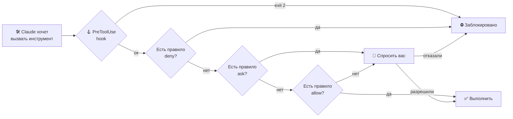

Пример `.claude/settings.json` для команды:

```json
{
  "permissions": {
    "allow": [
      "Bash(npm run test:*)",
      "Bash(npm run lint)",
      "Bash(git status)",
      "Bash(git diff:*)"
    ],
    "ask": [
      "Bash(git push:*)"
    ],
    "deny": [
      "Read(./.env)",
      "Read(./.env.*)",
      "Read(./secrets/**)",
      "Bash(rm -rf:*)",
      "Bash(curl:*)"
    ]
  }
}
```

**Чек-лист:**

- секреты закрыты через `deny` и не лежат в CLAUDE.md;
- `git push`, деплой и миграции — только с подтверждением;
- автономные запуски (`-p`, CI, `--dangerously-skip-permissions`) — только в контейнере или песочнице без доступа к проду;
- данные из интернета и MCP — это данные, а не инструкции: следите за промпт-инъекциями;
- перед коммитом — `git diff`, а не «принять всё».

## Готовые шаблоны

<details>
<summary><b>📄 CLAUDE.md — короткий и рабочий</b></summary>

```markdown
# Проект: магазин на Next.js + PostgreSQL

## Команды
- npm run dev — запуск
- npm test — тесты (Vitest), npm run lint — линтер
- npm run db:migrate — миграции (только с подтверждения!)

## Архитектура
- src/app — роуты, src/lib — бизнес-логика, src/db — доступ к БД
- Вся работа с БД только через src/db, не из компонентов

## Правила
- TypeScript strict, без any
- Новый код — с тестами, баг — сначала падающий тест
- Не трогать src/legacy без явной просьбы
- Перед завершением задачи: npm test && npm run lint
```

</details>

<details>
<summary><b>🧰 Skill — повторяемая процедура</b></summary>

`.claude/skills/release-notes/SKILL.md`:

```markdown
---
name: release-notes
description: Готовит release notes по коммитам с последнего тега. Используй, когда просят релиз, changelog или заметки к версии.
---
1. Найди последний тег: git describe --tags --abbrev=0
2. Собери коммиты: git log <тег>..HEAD --oneline
3. Сгруппируй: ✨ Новое, 🐛 Исправления, ⚙️ Внутреннее
4. Пиши для пользователей, а не для разработчиков
5. Добавь блок в начало CHANGELOG.md
```

Вызов: `/release-notes` — или Claude сам подхватит skill по описанию.

</details>

<details>
<summary><b>🔌 MCP — подключение внешних инструментов</b></summary>

```bash
# Браузер для проверки UI и скриншотов
claude mcp add playwright -- npx @playwright/mcp@latest

# Посмотреть подключённые серверы и их статус
claude mcp list
```

Общий для команды `.mcp.json` в корне репозитория:

```json
{
  "mcpServers": {
    "playwright": {
      "command": "npx",
      "args": ["@playwright/mcp@latest"]
    }
  }
}
```

</details>

<details>
<summary><b>🤖 GitHub Actions — @claude в issues и PR</b></summary>

Самый быстрый способ — выполнить в Claude Code `/install-github-app`. После этого достаточно написать в issue или PR:

```text
@claude реализуй эту задачу и открой PR
@claude сделай ревью этого PR с фокусом на безопасность
```

Готовые workflow — в [.github/workflows/](.github/workflows/).

</details>

## Экономия контекста и денег

| Приём | Эффект |
|---|---|
| `/clear` между задачами | не платите за чужую историю в каждом запросе |
| `/compact` с подсказкой, что сохранить | длинная задача без переполнения |
| Поиск и чтение логов — в субагента | в главный контекст попадает вывод, а не тысячи строк |
| Модель под задачу (`/model`) | сильная — для архитектуры и сложных багов, быстрая — для рутины и поиска |
| `@файл` вместо «найди сам» | меньше лишних чтений |
| Короткий CLAUDE.md, детали — в skills | skill грузится только когда нужен |
| Отключать неиспользуемые MCP-серверы | описания инструментов тоже занимают контекст |
| `/context` и `/cost` | видно, куда уходят токены |

## Путь к уровню PRO

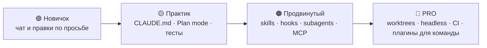

## Частые проблемы

| Симптом | Причина | Что сделать |
|---|---|---|
| Claude «забыл» договорённости | контекст сжат или переполнен | вынести в CLAUDE.md, вести `NOTES.md`, `/clear` и начать с плана |
| Игнорирует правило из CLAUDE.md | правило утонуло среди прочего | сократить файл, критичное — в hook или `deny` |
| Ходит по кругу с одной ошибкой | замусоренный контекст | `Esc Esc`, откатиться и дать больше данных: лог, тест, гипотезу |
| Меняет лишние файлы | нет границ в задаче | указать, какие файлы трогать нельзя, работать по плану |
| Постоянно спрашивает разрешения | нет allowlist | `/permissions` или `permissions.allow` в settings |
| MCP-сервер не видно | не запустился или не тот scope | `claude mcp list`, `/mcp`, проверить `.mcp.json` |
| Hook не срабатывает | неверный `matcher` или путь | `/hooks`, запустить скрипт вручную, проверить exit code |

## Прогресс

Скопируйте в свою заметку или issue и отмечайте:

```markdown
- [ ] 00 Установка          - [ ] 06 Subagents        + Лаба 5
- [ ] 01 Промптинг          - [ ] 07 Hooks            + Лаба 6
- [ ] 02 CLAUDE.md + Лаба 1 - [ ] 08 MCP              + Лаба 7
- [ ] 03 Настройки + Лаба 2 - [ ] 09 Плагины
- [ ] 04 Workflow  + Лаба 3 - [ ] 10 Headless и CI    + Лаба 8
- [ ] 05 Skills    + Лаба 4 - [ ] 11 Pro-приёмы (итоговый чек-лист)
```

## Структура репозитория

```
.
├── course/                  # 12 модулей + cheatsheet.md + faq.md
├── labs/                    # 8 лабораторных работ
├── recipes/prompts.md       # библиотека промптов
├── starter-kit/             # готовая конфигурация для копирования
│   ├── CLAUDE.md  .mcp.json
│   └── .claude/
│       ├── settings.json    # permissions + hooks + statusLine
│       ├── skills/          # 8 skills
│       ├── agents/          # 5 субагентов
│       ├── hooks/           # 4 hook-скрипта
│       ├── rules/           # правила по путям
│       ├── output-styles/   # режим наставника
│       └── statusline.sh
├── plugin-example/          # пример плагина
├── install.sh               # установщик starter-kit
├── scripts/validate.py      # проверки (запускаются в CI)
└── .github/workflows/       # @claude, авто-ревью PR, валидация
```

## Участие

Нашли устаревшую команду или хотите добавить лабу/шаблон? См. [CONTRIBUTING.md](CONTRIBUTING.md). История изменений — [CHANGELOG.md](CHANGELOG.md).

## Полезные ссылки

- Документация: https://code.claude.com/docs
- Best practices от Anthropic: https://www.anthropic.com/engineering/claude-code-best-practices
- GitHub Action: https://github.com/anthropics/claude-code-action

> ⚠️ Claude Code быстро развивается. Если команда или поле не работает — сверьтесь с `/help` и официальной документацией и [откройте issue](https://github.com/justxor/claude-code-pro-course/issues/new/choose).

## Лицензия

[MIT](LICENSE) — используйте, копируйте, адаптируйте.
