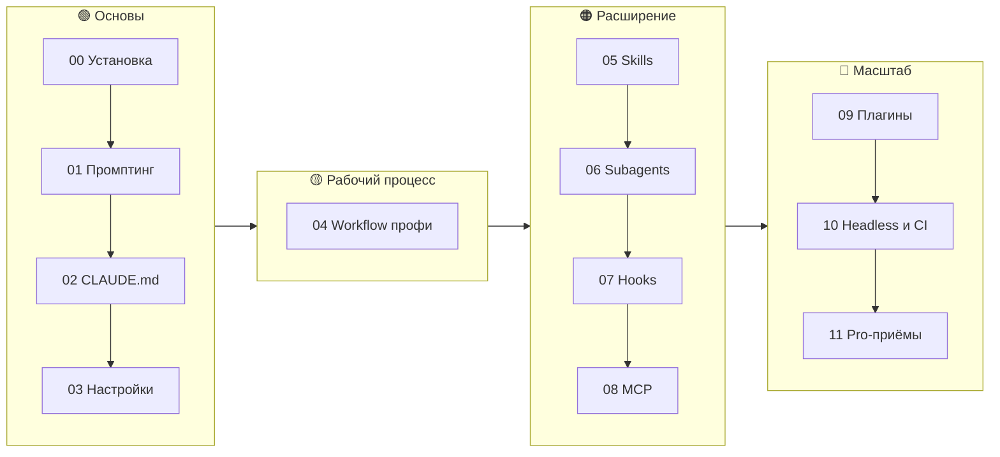
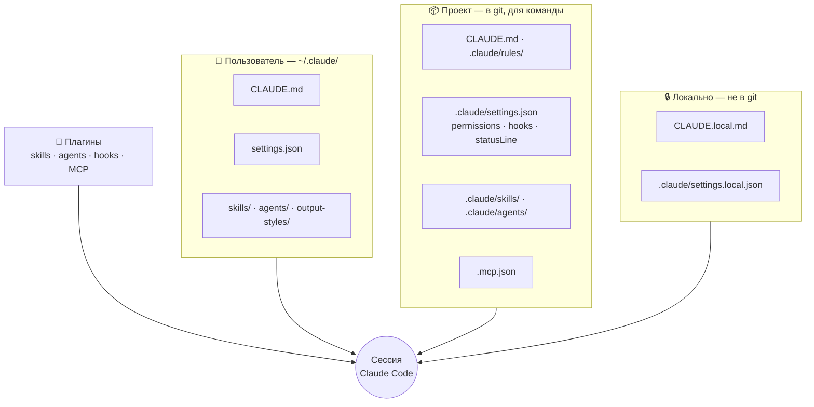

# Claude Code PRO — курс и гайд

> Практический курс по работе с **Claude Code** на русском: от первого запуска до профессиональной настройки команды.
> CLAUDE.md, settings, skills, subagents, hooks, MCP, плагины, headless-режим и CI — с лабораторными работами и готовыми шаблонами, которые можно скопировать в свой проект.

[](https://github.com/justxor/claude-code-pro-course/actions/workflows/validate.yml)


---

## Что внутри

| | |
|---|---|
| 📚 **[12 модулей](#программа)** | Теория с примерами: от установки до мульти-агентной работы |
| 🧪 **[8 лабораторных](labs/)** | Задания с критериями «готово» — закрепить на практике |
| 🧰 **[Starter kit](starter-kit/)** | 8 skills, 5 субагентов, 4 hooks, правила, statusline, output style — ставится одной командой |
| 💬 **[Библиотека промптов](recipes/prompts.md)** | Проверенные формулировки для 13 типов задач |
| 🧩 **[Пример плагина](plugin-example/)** | Как упаковать настройки и раздать команде |
| ⚙️ **[GitHub Actions](.github/workflows/)** | `@claude` в issues/PR и авто-ревью |
| 📋 **[Шпаргалка](course/cheatsheet.md) · [FAQ](course/faq.md)** | Всё важное на одной странице и решения типичных проблем |

## Для кого

- Разработчики, которые уже пробовали Claude Code и хотят выжать из него максимум.
- Тимлиды, которым нужно настроить единые правила для команды.
- Все, кто хочет автоматизировать рутину: ревью, тесты, коммиты, CI.

## Быстрый старт за 5 минут

```bash
# 1. Установите Claude Code
curl -fsSL https://claude.ai/install.sh | bash     # macOS / Linux / WSL
# или: npm install -g @anthropic-ai/claude-code

# 2. Поставьте starter-kit в свой проект
git clone https://github.com/justxor/claude-code-pro-course.git
bash claude-code-pro-course/install.sh ~/path/to/my-project

# 3. Запустите
cd ~/path/to/my-project && claude
> /context          # что загружено
> /onboard          # skill из starter-kit: обзор проекта
```

## Маршрут обучения



## Программа

| # | Модуль | Что освоите | Практика |
|---|--------|-------------|----------|
| 00 | [Установка и первый запуск](course/00-install.md) | Установка, логин, интерфейс, горячие клавиши | — |
| 01 | [Основы работы и промптинг](course/01-basics-prompting.md) | Постановка задач, контекст, @-упоминания, изображения | — |
| 02 | [CLAUDE.md — память проекта](course/02-claude-md.md) | Иерархия, импорты, `.claude/rules/` | [Лаба 1](labs/lab-01-onboarding.md) |
| 03 | [Настройки и разрешения](course/03-settings-permissions.md) | settings.json, allow/ask/deny, режимы, модели | [Лаба 2](labs/lab-02-permissions.md) |
| 04 | [Workflow профи](course/04-workflow.md) | Plan mode, TDD, чекпоинты, управление контекстом | [Лаба 3](labs/lab-03-tdd-feature.md) |
| 05 | [Skills и slash-команды](course/05-skills.md) | SKILL.md, аргументы, авто-вызов | [Лаба 4](labs/lab-04-skill.md) |
| 06 | [Subagents](course/06-subagents.md) | Изоляция контекста, специализация, параллельность | [Лаба 5](labs/lab-05-subagents.md) |
| 07 | [Hooks](course/07-hooks.md) | Автоформат, защита файлов, уведомления | [Лаба 6](labs/lab-06-hooks.md) |
| 08 | [MCP](course/08-mcp.md) | GitHub, браузер, БД, свои серверы | [Лаба 7](labs/lab-07-mcp.md) |
| 09 | [Плагины и маркетплейсы](course/09-plugins.md) | Упаковка и раздача конфигурации команде | [Пример](plugin-example/) |
| 10 | [Headless, CI и GitHub Actions](course/10-headless-ci.md) | `claude -p`, JSON, `@claude` в PR, Agent SDK | [Лаба 8](labs/lab-08-automation.md) |
| 11 | [Продвинутые приёмы](course/11-pro-tips.md) | Worktrees, мульти-агенты, экономия, безопасность | Чек-листы |

## Как устроена конфигурация Claude Code



**Что куда класть:**

| Хочу… | Инструмент |
|---|---|
| чтобы Claude знал правила проекта | `CLAUDE.md`, `.claude/rules/` |
| не отвечать на одни и те же вопросы о разрешениях | `permissions.allow` в settings |
| запретить опасное | `permissions.deny` + hook `PreToolUse` |
| переиспользовать процедуру / промпт | **skill** |
| изолировать исследование или дать узкую роль | **subagent** |
| чтобы что-то происходило **всегда** | **hook** |
| подключить внешнюю систему | **MCP** |
| раздать всё это другим репозиториям | **плагин** |
| запускать без человека | `claude -p`, GitHub Actions, Agent SDK |

## Главные принципы (TL;DR)

1. **Контекст — ваш главный ресурс.** Чистите (`/clear`), сжимайте (`/compact`), выносите исследование в subagents.
2. **Сначала план, потом код.** Plan mode (`Shift+Tab`) для всего, что сложнее одного файла.
3. **Дайте Claude способ проверить себя** — тесты, линтер, скриншоты. Это самый сильный рычаг качества.
4. **CLAUDE.md короткий и конкретный.** Команды, стиль, запреты. Не роман.
5. **Повторяется трижды — сделайте skill.** Должно случаться всегда — сделайте hook.
6. **Разрешения — через allowlist,** а не через `bypassPermissions`.

## Прогресс

Скопируйте в свою заметку или issue и отмечайте:

```markdown
- [ ] 00 Установка          - [ ] 06 Subagents        + Лаба 5
- [ ] 01 Промптинг          - [ ] 07 Hooks            + Лаба 6
- [ ] 02 CLAUDE.md + Лаба 1 - [ ] 08 MCP              + Лаба 7
- [ ] 03 Настройки + Лаба 2 - [ ] 09 Плагины
- [ ] 04 Workflow  + Лаба 3 - [ ] 10 Headless и CI    + Лаба 8
- [ ] 05 Skills    + Лаба 4 - [ ] 11 Pro-приёмы (итоговый чек-лист)
```

## Структура репозитория

```
.
├── course/                  # 12 модулей + cheatsheet.md + faq.md
├── labs/                    # 8 лабораторных работ
├── recipes/prompts.md       # библиотека промптов
├── starter-kit/             # готовая конфигурация для копирования
│   ├── CLAUDE.md  .mcp.json
│   └── .claude/
│       ├── settings.json    # permissions + hooks + statusLine
│       ├── skills/          # 8 skills
│       ├── agents/          # 5 субагентов
│       ├── hooks/           # 4 hook-скрипта
│       ├── rules/           # правила по путям
│       ├── output-styles/   # режим наставника
│       └── statusline.sh
├── plugin-example/          # пример плагина
├── install.sh               # установщик starter-kit
├── scripts/validate.py      # проверки (запускаются в CI)
└── .github/workflows/       # @claude, авто-ревью PR, валидация
```

## Участие

Нашли устаревшую команду или хотите добавить лабу/шаблон? См. [CONTRIBUTING.md](CONTRIBUTING.md). История изменений — [CHANGELOG.md](CHANGELOG.md).

## Полезные ссылки

- Документация: https://code.claude.com/docs
- Best practices от Anthropic: https://www.anthropic.com/engineering/claude-code-best-practices
- GitHub Action: https://github.com/anthropics/claude-code-action

> ⚠️ Claude Code быстро развивается. Если команда или поле не работает — сверьтесь с `/help` и официальной документацией и [откройте issue](https://github.com/justxor/claude-code-pro-course/issues/new/choose).

## Лицензия

[MIT](LICENSE) — используйте, копируйте, адаптируйте.
